```{r setup, include=FALSE}
knitr::opts_chunk$set(echo = FALSE)
```

# 1.0 Critique of Visualization


### 1.1 Clarity

1. The title “Merchandise Trade of Top Six Trading Countries, 2019-2020” is ambiguous and doesn’t stand on its own. Without the context that the graphic is provided by the Department of Statistics, Singapore (DOS), the viewer is left wondering top six trading countries with whom? It can’t be global because the six countries in the graphic don’t represent the top six countries globally by GDP. However, even with this context, it is unclear.

    Another ambiguity with the graphic’s title is it specifically calls out “Countries” but Hong Kong is not a country but a part of China.

    The title is also not very descriptive. The title describes the data, but it doesn’t share the intent or main message behind the graphic.

2. The biggest issue with the chart is with the axes, specifically the scaling of the y-axes are different within panels and between panels. First, consider the panel for Taiwan. At first, it appears that imports and exports with Taiwan are relatively equal. However, upon closer inspection of the export y-axis (left-hand side) and the import y-axis (right-hand side), we realize that the scales are different. The import scale is double the export scale. Therefore, the insight—imports from Taiwan are double that of exports to Taiwan—is obscured.

    Second, let’s attempt to compare two panels against each other: Hong Kong and Mainland China. At a glance, the export areas between Hong Kong and Mainland China appear to be relatively the same size. However, the scales are slightly different which makes it difficult to tell whether they’re equal or if Hong Kong vs. Mainland China is higher or lower.
    
3. In addition to the y-axes, the x-axes are also not all the same. Japan’s x-axis only shows 2020 whereas the other panels show 2019, 2020, and 2021. This creates ambiguity.

4. There are other more minor issues with the axes. The x-axes label says “Month of Period” but the x-axes values are years which creates incongruence between the label and the values. In addition, the x-axes for all the countries except Japan go up to 2021, but the title suggests the data is only between 2019-2020 which again creates ambiguity.
    
5. Another minor issue is the y-axes doesn’t label the currency (S$ or SGD) which is especially necessary given there’s no indication that the graphic is by or for Singapore thus leaving the reader guessing as to the real value of the imports and exports.

### 1.2 Aesthetics

1. Since exports and imports are not vastly different in terms of shape and area, the shaded areas mostly overlap with each other and the colors blending together mucks the clarity of the graphic.

2. The graphic both uses too much non-data ink and not enough. The 3 axes labels repeated 6 times for each panel for a total of 24 labels is too much non-data ink and doesn’t make it clearer or easier to read the graphic. The legend label “Measure Names” is not needed and unhelpful. The panel “titles” have a larger font size than the graphic title itself.

    On the other hand, the graphic also suffers from not enough non-data ink. The axes values are too light compared to the axes labels which makes it easy to overlook. There are very light horizontal gridlines in each panel. They’re so light they’re almost imperceptible behind the shaded areas. The graphic lacks a useful background grid that enhances the readability of the graphic.
    
3. The panels don’t appear to be organized in any meaningful way either in increasing or decreasing order of trade size. The panels are on 2 arbitrary rows which hinders the ability to compare between panels.

4. Given the graphic is multi-panel, the decision to include a legend adds extra mental burden on the reader. After reading each panel, the reader has to remind themselves whether blue or orange is export or import.

# 2.0 Alternative Design

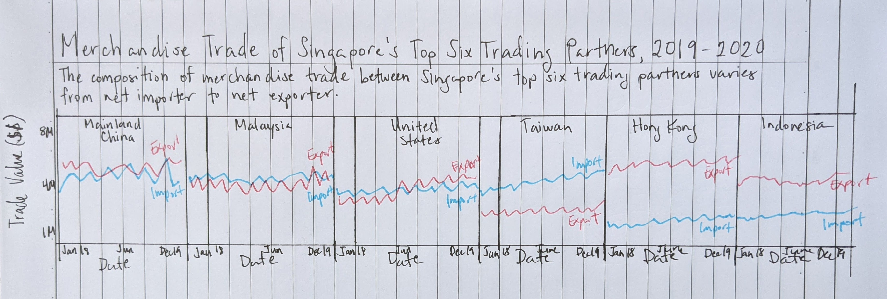

### 2.1 Clarity

1. I edited the title to be: “Merchandise Trade of Singapore’s Top Six Trading Partners by Total Trade Value, 2019-2020.” This title is improved because it clarifies who the trade is with (Singapore), and it prevents any confusion by changing “countries” to “partners.”

    The redesign also includes a subtitle that shares a possible main insight to be gleaned from the graphic: "Merchandise trade with Mainland China, Malaysia, the United States, and Indonesia dropped late 2019 to mid 2020 at the onset of the COVID-19 pandemic. Recovery varies by country."

2. To remain consistent with the title “Top Six Trading Partners, 2019-2020,” Japan is replaced with Indonesia because Singapore’s trade with Indonesia (107M thousands of dollars) is larger than its trade with Japan (100M thousands of dollars).

3. In the redesign, I forced the y-axes to be the same across panels and x-axes to be the same across panels. This enables comparisons between markets. I also removed the second y-axes thus putting imports and exports on the same scale. This enables comparisons of imports and exports within panels.

    To add further clarity, I changed the y and x axes labels to “Trade Value (S$)” and “Date” respectively.

    Lastly, I changed the date values from YYYY to mmm yy to clarify the dates are continuous rather than discrete.
    
### 2.2 Aesthetic

1. To prevent the confusion arising from the import and export areas overlapping with each other, I changed the chart to a line graph.

2.	With respect to the balancing of non-data ink, I reduced the number of axes labels from 24 to 7. I reduced the relative size of the panel “titles.” I removed the row divider since there’s only one row.

    I darkened the axes values to the same color as the axes label. I added ticks to the x-axis. I also darkened the grid lines so they’re visible but not distracting. Furthermore, the clear presence of the gridlines creates a background that anchors the graphic.

3.	I consolidate the panels into one row instead of two. This facilitates the comparison of Trade Value (S$) across countries. In addition, I order the panels on total merchandise trade by country in descending order.

4. I removed the need for a legend by using direct labeling instead.

# 3.0 Proposed Visualization

To see the redesigned visual in Tableau Public, click [here](https://public.tableau.com/app/profile/kevin.sunga/viz/dataviz_makeover_1_final/TopSixTradingPartnersGraph).

# 4.0 Step-by-Step guide

### 4.1 Clean the data in Microsoft Excel

1.	In Microsoft Excel, open “outputFile.xlsx”.

2.	In tab T1 delete rows 1-5 and 127+. In tab T2 delete rows 1-5 and 99+. The important thing is the first row in each tab should be the header. This will allow Tableau to read the data.

3.	Save the file.


### 4.2 Import the data into Tableau

1.	From a file, import “outputFile.xlsx” into Tableau Desktop. To a "File" > "Microsoft Excel".

2.	Once imported, create a new union on Tableau by dragging “New Union” to the center.

3.	Next, drag the “Imports” and “Exports” sheets into the popup page and click “OK”.


### 4.3 Transform and clean the data

1. After importing the data into Tableau, we will need to transform the data. Specifically, we will need to unpivot the data to make it long instead of wide. To do this, select all the date columns, right-click, and click “Pivot”.

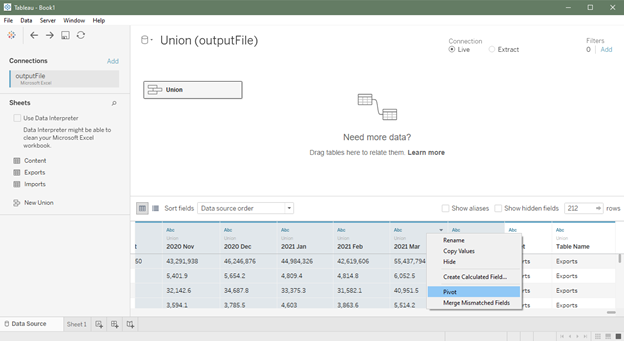

2. You should now have 5 columns 2 of which are named “Pivot Field Names” and “Pivot Field Values”. Let’s rename these columns to be more helpful. Rename “Pivot Field Names” to “Trade Month” by right-clicking and clicking “Rename”. Next, rename “Pivot Field Values” to “Trade Value”.

3. Let’s also rename the “Sheet” column to “Trade Type” to help us identify whether a row is an import or an export. We can hide the “Table Name” column since it’s a repetitive field.

4. Let’s also rename the “Variables” column to “Market”.

5. We need to ensure that our columns are using the correct data types. “Trade Month” should be a Date type. “Trade Value” should be a Number (decimal) type. “Market” and “Trade Type” should be string types. To change a column’s data type, simply click on the top left-hand corner of the column and select the appropriate data type.


6. The resulting data should have 4 columns as follows:

{width=50%}

7. We want to create some calculated fields. First, we want to clean up the “Market” field and extract only the market name. To do this, right-click on “Market” and click on “Create” > “Calculated Field…”

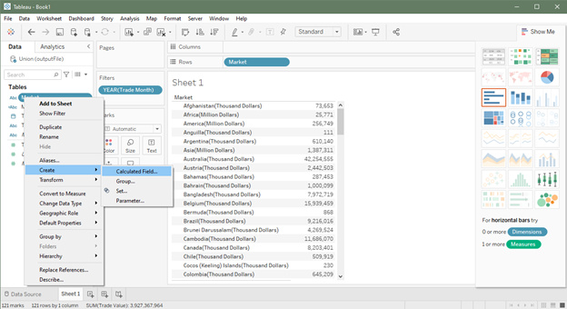

8. We’ll use the function REGEX_EXTRACT to extract the country name. Input the following REGEX expression:  

       TRIM(REGEXP_EXTRACT([Market],"^(.*?)\("))
     
     and click “OK”. Let’s name this new field “Market (Cleaned)”.


9.	Next, let’s convert “Trade Value” to a measure by right-clicking on it and clicking “Convert to Measure”.


10.	Lastly, let’s create a new date field by right-clicking on “Trade Month” and clicking “Create” > “Custom date…”


11.	Name this new field “Date” and for detail choose “Months”.

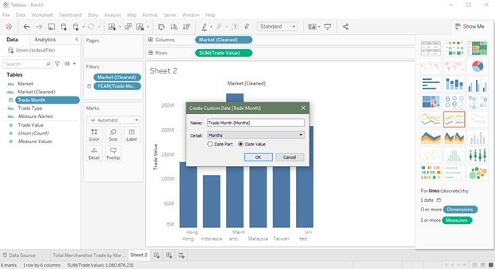

### 4.4 Verify Top 6 Markets

1. With our data successfully imported, transformed, and cleaned, we can begin to work with our data.

2. The original graphic claims that the top six trading partners of Singapore between 2019-2020 are: Mainland China, the United States, Malaysia, Hong Kong, Taiwan and Japan. Let’s verify that this is indeed accurate.

3. First, create a new worksheet, and let’s add “Market” to rows.

4. Drag “Trade Value” to “Text” in the marks box. Right-click on “Trade Value” in the marks box and ensure that the measure being used is SUM.


5. Next, we want to filter the data to include only data for 2019-2020. Drag “Trade Month” to the filters box. In the subsequent popups, first select “Years” and then select 2019 and 2020 from the list of years. Click “OK” to filter.


6. Right-click on our newly created filter and click on “Apply to Worksheets” > “All Using this Data Source”. In doing this, we save ourselves from having to filter on the “Trade Month” column again later.

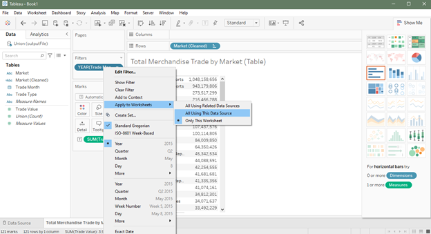

7. Lastly, let’s sort the column in descending order by right-clicking on the “Trade Value” column and clicking “Sort descending”.

8. The resulting table shows Singapore’s total trade value between 2019-2020 by “Market” in descending order (ignore the Total Merchandise rows). The top six countries are: Mainland China, Malaysia, the United States, Taiwan, Hong Kong, and Indonesia. Given the results of our analysis, we will replace Japan from the original graphic with Indonesia.

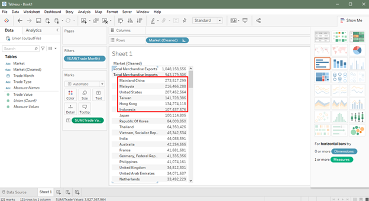

### 4.5 Create redesigned graphic

1. Create a new worksheet. First, let’s filter for the top six markets: Mainland China, Malaysia, the United States, Taiwan, Hong Kong, and Indonesia. Drag “Market (Cleaned)” into the filters box and select the six markets and click “OK”. (Reminder: We don’t need to filter on “Trade Month” since we set up a global filter previously.)

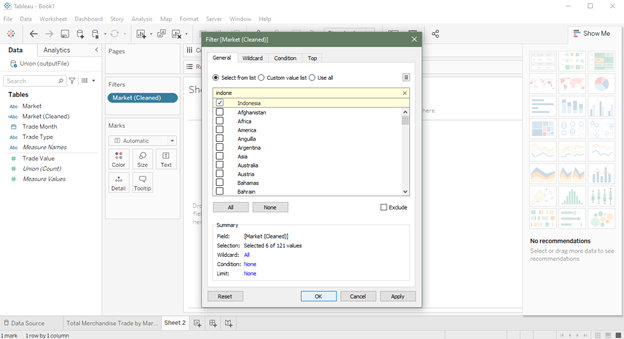

2. Next, drag “Market (Cleaned)” and “Date” to columns. Drag “Trade Value” to Rows.

3. Right-click on “Date” in the columns and convert it to an “Attribute”.

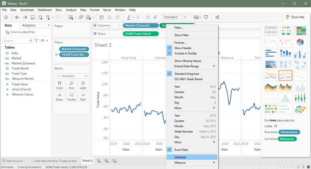

4. Drag “Date” into “Detail” in the marks box. The graph should look something like this so far.

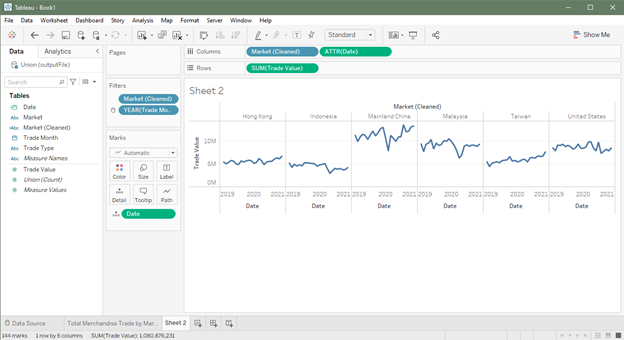

5. Drag “Trade Type” into “Color” and “Label” in the marks box.

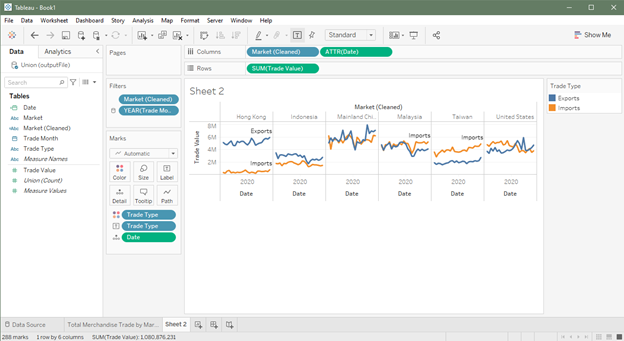

6. We’re almost done! Now we just need to do some detail and polishing. Let’s remove the legend and change the color of the “Trade Type” labels to match the line. Click on the down arrow in the legend and click “Hide.” Click on “Label” and under “Font” click on “Match Mark Color”. We’ll also use “Center” horizontal alignment.

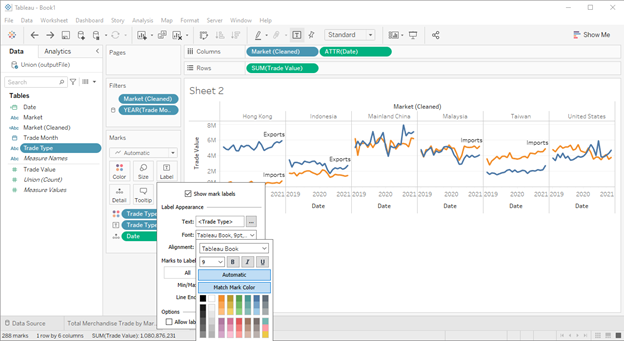

7. Now, let’s work on the axes. Rename the y-axes to “Trade Value (S$)” to clarify the currency.

8. Right-click on the y-axis and click “Format”. Change the title's font to Tableau Book, font size to 10, and color to HTML #333333. Do the same for the x-axis label for consistency.

9. To clarify that the x-axis is a continuous variable, let’s change the scale of the x-axis and add ticks. Right-click on the x-axis and click “Format”. On the left pane, change dates to custom and input the following format “mmm yy”. For ticks, I chose the color #555555 and 25% transparency.


10.	Increase the font size of the market names to size 12. Hide the “Market (Cleaned)” label.

11. Sort the panes by “Trade Value”. Right-click on “Market (Cleaned)” in the columns and click “Sort…”. For Sort By choose “Field”, for Sort Order choose “Descending”, for Field Name choose “Trade Value”, and for Aggregation choose “Sum”. Now the panes are in a logical order.

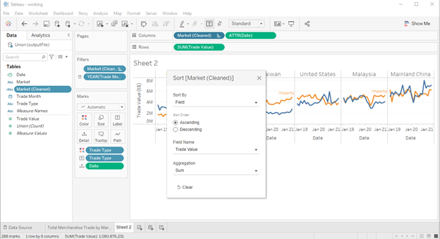

12.	Add row gridlines to facilitate reading the graph. In the top bar, click on “Format” > “Lines…”. On the left pane, navigate to the rows tab. Select the solid line, the thin line, and set the color to #f2f2f2.


13. Remove the row divider. Click on “Format” > “Borders”. On the left pane, set row divider to none.

14. The last step is to add our titles. Set the title to “Merchandise Trade of Singapore’s Top Six Trading Partners by Total Trade Value, 2019-2020” using font Calibri, font size 18, and color #000000. To make it easy for the reader to know what the graph is about, let’s also add a subtitle “Merchandise trade with Mainland China, Malaysia, the United States, and Indonesia dropped late 2019 to mid 2020 at the onset of the COVID-19 pandemic. Recovery varies by country” using font Calibri, font size 14, and color #333333.

15.	The final graphic should look like the graphic below.

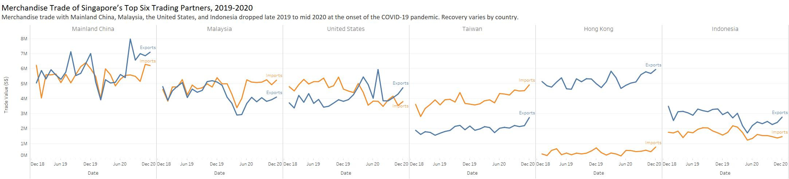

# 5.0 Derived Insights

1. Trade drops significantly for Mainland China, Malaysia, the United States, and Indonesia from late 2019 to mid 2020. The drop coincides with the time when each country was hit with COVID-19—China in late 2019/early 2020 and the United States in March 2020. Unlike these noted countries, trade doesn’t visibly drop with Taiwan and Hong Kong—both regions that handled COVID-19 comparatively well. This is made clearer when we add trendlines.

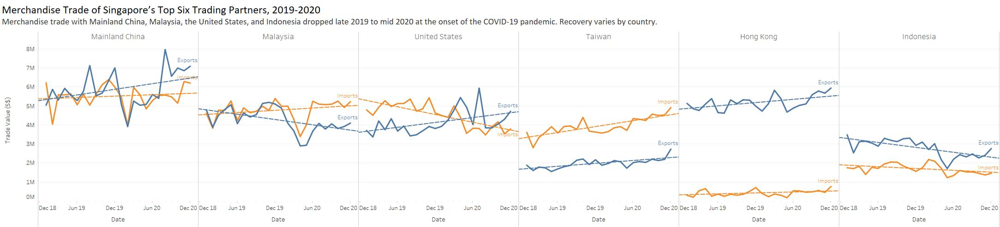

2. For Taiwan, the import line is above the export line which tells us that Singapore is a net importer with Taiwan. Conversely, Singapore is a net exporter with Hong Kong and Indonesia. The trade balance is most unequal with Hong Kong where exports are roughly 800% more than imports.

3. Starting in January 2020, the import line for Malaysia begins to cleanly diverge from the export line which indicates a possible shift in trading relationships between the countries. Similarly, exports overtake imports with Mainland China late 2020.

4. In terms of total trade value, Singapore’s top trading partners between 2019-2020 in descending order are: Mainland China, Malaysia, the United States, Taiwan, Hong Kong, and Indonesia.