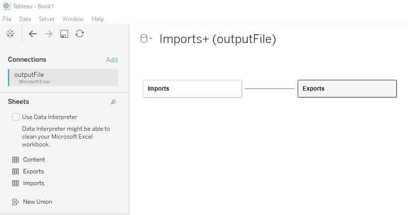
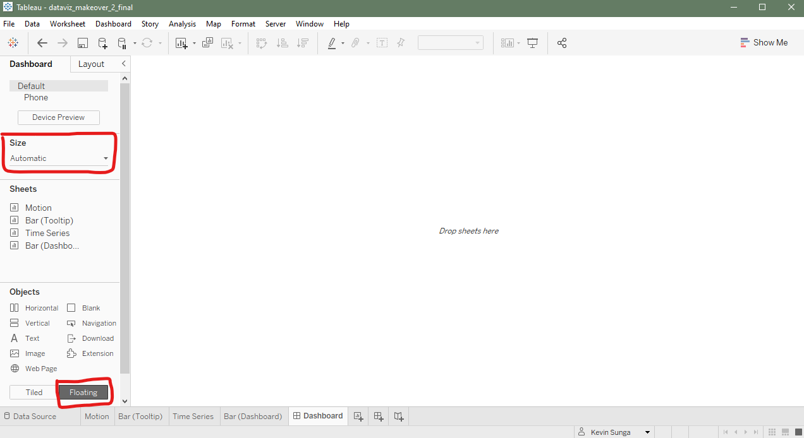

<style type="text/css">
  c{
    font-family: 'Courier New', monospace;
  }
  
  body{
    font-size: small;
  }
</style>

```{r setup, include=FALSE}
knitr::opts_chunk$set(echo = FALSE)
```

{width=70%}

# 1.0 Clarity

| No. | Critique | Alternative Design |
|--|:----------------|:---------------------------------------|
|C1| It’s not clear what the axes are measuring. Is it the total value of net imports and net exports? Moreover, the scale isn’t explicit. Based on some context clues, my guess is it’s billions, but the graph would be better if it was explicit. | Relabel the x- and y-axes as “Import Value (S\$)” and “Export Value (S\$)” respectively and add “B” to the axes values to signify the scale of the graph is billions.|
|C2| The center of the circle is used to indicate whether a trading partner is a net importer or a net exporter.| Use a color scale to indicate whether a trading partner is a net importer or a net exporter. This method is better for several reasons: 1) it is easier and faster to tell the trading partner’s status and 2) it also conveys a degree or magnitude of net importer or net exporter as opposed to just a binary.|
|C3| The year and duration are not mentioned anywhere.| First, add the year and time period to the title of each graph.<br><br> Second, add a filter to enable the ability to see trade by custom time dimensions.|
|C4| The trading partners that are included are not mentioned anywhere. Why are some trading partners included and others are not?| Add an explanation: Singapore’s Top 10 Trading Partners from 1976-2020 are included.|
|C5| The “information” text introduces time components which suggests that the graph should convey some element of time or duration. For example, “Since 2009, the value of exports exceeds imports for merchandise trade with Mainland China.” Unfortunately, bubble graphs, at least the way it’s currently visualized, are not suited for visualizing data over time.| This critique is addressed in three ways.<br><br> First, I add a date filter using date ranges to enable the user to choose the time period to analyze.<br><br> Second, the bubble graph can be animated and trails can be added. The trails can be analyzed to understand the time component while maintaining the same original visual. This can be further supplemented by surfacing more detailed information in the tooltip.<br><br> Third, the bubble graph can be supplemented by a time series line graph. To make the two graphs work more seamlessly together in a dashboard view, it would also be recommended to add an action that synchronizes the highlighting and interactivity of both graphs.|
|C6| The graph claims that Taiwan is the top net exporter and Hong Kong is the top net importer. Beyond this, we aren’t able to understand how other countries rank. For example, who are the 2nd or 3rd importers and exporters?| Use the tooltip to surface more detailed information when a user hovers over a trading partner. For example, a trading partner’s relative rank in terms of imports and exports.|
|C7| It’s not possible to intuit from the graph whether Singapore as a country overall is a net importer or net exporter.| To be able to address this, a simple bar chart comparing imports and exports for Singapore inclusive of all the trading partners can be added to the dashboard view. This bar chart should be dynamic and change with the date and market filters on the dashboard.|

# 2.0 Aesthetics

|No.| Critique | Alternative Design |
|--|:----------------|:---------------------------------------|
|A1| The use of solid colors makes it such that when the circles overlap with each other, they obscure the centers which are important in determining whether a market is a net importer or exporter.| The circles can be made opaque. Furthermore, the use of a color scale to denote net import and net export renders the center point irrelevant and thus it can be removed.|
|A2| The graph uses 12+ colors which research has shown is more colors than humans can effectively use. In Fundamentals of Data Visualization, Claus O. Wilke writes “Once we reach eight to ten different categories or more, the task of matching colors to categories becomes too burdensome to be useful, even if the colors remain sufficiently different to be distinguishable in principle.” Moreover, Wilke argues that color should serve a purpose, and in the graphic, color doesn’t serve a purpose other than to differentiate between trading partners which can be more effectively achieved by a label.| Use color to denote net importer and net exporter status on a scale in both the “Motion” and “Time Series” graphs. This helps to visually indicate a trading partner’s status. For the “Motion” graph, the color scale also helps to differentiate between the trading partners even though this isn’t the primary objective of the use of color. For the “Time Series” graph, the use of the color scale enables the reader to easily and quickly understand net balance trends overtime (e.g. changing from net import to net exporter).<br><br> Instead of using color to differentiate between trading partners, labels should be used as recommended by Wilke. For the “Time Series” graph in particular, the labels have a high likelihood of overlapping with each other. To address this, add highlighting to surface the trading partner of interest and visually deprioritize others.|
|A3| Apart from the diagonal divide for imports and exports, the background of the graph has no visual aids to facilitate the reading and interpreting of the graph. This makes it difficult get more precise readings of the x- and y-axes.| The diagonal divide for imports and exports is useful, but it needn’t be accomplished by highlighting areas. Instead, add a diagonal reference line that’s more subtle but still visually divides the graph between net import and net export.|

# 3.0 Proposed Visualization


To see the redesigned visual in Tableau Public, click [here](https://public.tableau.com/app/profile/kevin.sunga/viz/dataviz_makeover_2_final/Dashboard).

# 4.0 Step-by-Step guide

|No.| Instructions | Image |
|--|:----------------|:---------------------------------------|
|S1| Open a new Tableau notebook. On the left-hand panel, import the file “outputFile.xlsx”. Once imported, drag the import table into the main pane. Next, drag the export table into the main pain to create a relationship between the two tables.| {width=100%}|
|S2| Next, we’ll want to pivot the date columns in both the import and export tables. Starting with the import table, select the first date column (it should be 1976 Jan). Scroll all the way to the right and hold SHIFT and click the last date column (it should be 2021 Apr). Once all the date columns are highlighted, click on the black down arrow above any of the columns and click “Pivot”. Repeat for the export table.| {width=100%}|
|S3| After pivoting the import and export tables, we need to do some further data processing.<br><br> Starting with the Pivot Field Names column in the import table, click on the “Abc” in the top left corner of the column and select “Date”. Rename the column to “Import Date”. Next, change the Pivot Field Values column to “Number (decimal)” and rename it “Import Value Raw”. Repeat for the export table.| {width=100%}|
|S4| We want to clean up the Variables column to get the market name isolated. To do this, click on the black down arrow in the Variables column and click “Split”. This will create two new columns. Rename Variables – Split 1 as “Import Market”. Rename Variables – Split 2 as “Import Scale”. Repeat for the export table.| {width=100%}|
|S5| Next, we want to create a new calculated field that normalizes the Value Raw columns.<br><br> Click on the black down arrow in the Import Value Raw column and click “Create Calculated Field…”. Name this new field “Import Value” and input the following formula: <c>CASE [Import Scale]<br> WHEN 'Million' THEN [Import Value Raw] * 1000000<br> ELSE [Import Value Raw] * 1000<br> END </c><br><br> Repeat for the export table.| {width=100%}|
|S7| To finish the data prep phase, let’s add some filters to the Data Source. On the top right-hand corner, click “Add” > “Add…” > “Import Market”. Filter for Malaysia, United States, Mainland China, Japan, European Union, Hong Kong, Indonesia, Taiwan, Republic of Korea, and Thailand which are Singapore’s top 10 trading partners overall. | {width=100%}|
|S8| Create a new worksheet and name it “Motion”. Drag “Import Value” to Columns, “Export Value” to Rows, and “Import Market” to the Detail shelf. The resulting graph should look something like what you see on the right.| {width=100%}|
|S9| Next, we’re going to create some new fields to help us add more dimension to the graph.<br><br> On the left pane, click on the black down arrow at the top right-hand corner and click “Create Calculated Field.” Name this field “Total Trade Value” and input the formula: <c>[Import Value] + [Export Value].</c><br><br> Create another calculated field. Name it “Net Balance” and input the formula: <c>[Export Value] - [Import Value]</c>.| {width=100%}|
|S10| Drag “Total Trade Value” to the Size shelf.<br><br> Drag “Net Balance” to the Color shelf.<br><br> Drag “Import Market” to the Label shelf.<br><br>| {width=100%}|
|S11| Let’s make some aesthetic modifications. These changes are optional but recommended.<br><br> Click on the Shape shelf and change the shape to a solid circle.<br><br> Click on the Size shelf and increase the size.<br><br> Click on the Color shelf and change opacity to 50-60%. Click on “Edit Colors…” and click on the checkbox “Use Full Color Range”.| {width=100%}|
|S12| Now, let’s add some filters.<br><br> Drag “Import Market” to the Filters shelf. The default settings are ok.<br><br> Drag “Import Date” to the Filters shelf. For dates, choose the “Range of Dates” option and click “Next” > “OK”.<br><br> Show both filters by right-clicking and clicking “Show Filter”.| {width=100%}|
|S13| Now, time to add some animation!<br><br> Drag “Import Date” to the Pages shelf.<br><br> In the Pages filter, click on the checkbox “Show history”. For the options, choose “Selected”, “All”, and “Trails”.<br><br> You can click on the right or left arrows in the Pages filter to animate the graph!| {width=100%}|
|S14| To make the animations smoother, go to “Format” > “Animations…”. Change Workbook Default “On” and change Duration to “0.50 seconds (Medium)”.| {width=100%}|
|S15| Now, we’re going to add a diagonal reference line to visually separate “net importers” and “net exporters”. First, create a calculated field named “Reference Line” and input “Import Value”.| {width=100%}|
|S16| Drag “Reference Line” to Rows. Right-click on the “Reference Line” axis and click “Dual Axis”.| {width=100%}|
|S17| Right-click on the “Reference Line” axis again and click “Synchronize Axis”.| {width=100%}|
|S18| Right-click on one of the grey circles and click “Trend Lines” > “Show Trend Lines”.| {width=100%}|
|S19| Right-click on the trend line and click “Format…”. Choose the wider dashes and change the color to dark red.| {width=100%}|
|S20| Let’s clean up the graph a bit.<br><br> First, remove all the fields from the “Reference Line” Marks shelf except for the “Import Market” Detail.<br><br> Second, again for the “Reference Line” Marks shelf, click on the Size shelf and decrease the size to the lowest.<br><br> Third, again for the “Reference Line” Marks shelf, click on the Color shelf and change opacity to 0%.<br><br> Lastly, right-click on the “Reference Line” axis and uncheck “Show Header”.| {width=100%}|
|S21| Now, we’ll work on adding some details in the tooltip.<br><br> First, create a new worksheet and name it “Bar (Tooltip)”.<br><br> Drag “Import Value” and “Export Value” to both Columns and Rows.<br><br> Next, click on “Show Me” on the top right-hand corner and click on the horizontal bar graph.| {width=100%}|
|S22| Format the graph by making it smaller. Aim roughly for 300x200.<br><br> Format the axis as well. Change the Scale to “Numbers (Custom)” and Display Units to “Billions (B)”.<br><br> Add “(S\$)” to the axis label to clarify the measurement.<br><br> The resulting graph should look something like the graph to the right.<br><br> Save this graph for now, and we’ll add it to the tooltip later.| {width=100%}|
|S23| Back to the “Motion” worksheet. We’re going to create four new calculated fields:<br><br> Name: “Rank by Total Trade Value”<br> Formula: <c>RANK_DENSE(SUM([Total Trade Value]), 'desc')</c><br><br> Name: “Rank by Import Value”<br> Formula: <c>RANK_DENSE(SUM([Import Value]), 'desc')</c><br><br> Name: “Rank by Export Value”<br>  Formula: <c>RANK_DENSE(SUM([Export Value]), 'desc')</c><br><br> Name: “Relationship”<br> Formula: <c>IF [Net Balance] < 0 THEN 'net importer'<br> ELSE 'net exporter'<br> END</c>| {width=100%}|
|S24| To enable the use of these new calculated fields in the tooltip, drag the “Rank by Total Trade Value”, “Rank by Import”, “Rank by Export”, and “Relationship” fields into the Tooltip shelf for Export Value.| {width=100%}|
|S25| Right-click on the “Rank” fields in the Marks shelf and click on “Compute Using” > “Import Market”.| {width=100%}|
|S26| Click on the Tooltip shelf and input the following text:<br><br> In <YEAR(Import Date)>, <Import Market> was ranked* <AGG(Rank by Total Trade Value)> in terms of total merchandise trade value which equaled <SUM(Total Trade Value)>. Singapore was a <ATTR(Relationship)> with a net balance (export - import) of <SUM(Net Balance)>. The breakdown into imports and exports are <SUM(Import Value)> and <SUM(Export Value)> respectively. In terms of relative size, imports rank* <AGG(Rank by Import Value)> while the exports rank* <AGG(Rank by Export Value)>.<br><br> * Compared to other markets included in the analysis.| {width=100%}|
|S27| Remember “Bar (Tooltip)”? Let’s insert that graph into the tooltip.<br><br> Click on the “Insert” dropdown > “Sheets” > “Bar (Tooltip)”. Click “OK”.| {width=100%}|
|S28| Click on the black down arrow for “SUM(Import Value)” in the Tooltip shelf and click “Format”.<br><br> Make sure you’re on the “Pane” tab.<br><br> Change the Numbers setting to “Currency (Custom)”, 0 Decimal Places, “Billions (B)” Display Units, and S\$ Prefix.<br><br> Repeat this for Export Value, Total Trade Value, and Net Balance.| {width=100%}|
|S29| Add a title “Animated Bubble Graph of Singapore Merchandise Import and Export Value by Trading Parnter, <Page Name>”.| {width=100%}|
|S30| We’re done with the “Motion” worksheet for now.<br><br> Create a new worksheet and call it “Time Series”.<br><br> Drag “Import Date” to Columns.<br><br> Drag “Total Trade Value” to Rows.| {width=100%}|
|S31| Drag “Import Market” to the Label and Detail shelves.<br><br> Drag “Net Balance” to the Color shelf.<br><br>| {width=100%}|
|S32| Repeat steps S26 and S27 for the “Time Series” graph.| {width=100%}|
|S33| Create two new calculated fields which we’ll use for the title.<br><br> Name: “Max Date”<br> Formula: <c>WINDOW_MAX(MAX([Import Date]))</c><br><br> Name: “Min Date”<br> Formula: <c>WINDOW_MIN(MIN([Import Date]))</c><br><br> Once created, drag “Max Date” and “Min Date” to the Detail shelf.| {width=100%}|
|S34| Go back to the “Motion” worksheet. Right-click on the “Import Date” filter and click on “Apply to Worksheets” > “All Using This Data Source”.<br><br> Go back to the “Time Series” worksheet. Right-click on the “Import Date” filter and click on “Show Filter”.| {width=100%}|
|S35| Change the title to:<br><br> Singapore Merchandise Import and Exports, <AGG(Min Date)> to <AGG(Max Date)>| {width=100%}|
|S36| We need to create one more graph. Thankfully, this one should be easy!<br><br> Right-click on the “Bar (Tooltip)” graph and click “Duplicate”. Rename this worksheet “Bar (Dashboard)”.<br><br> In this worksheet, click on the black down arrow for “Tooltip” in the Filters shelf and click “Remove”.| {width=100%}|
|S37| Go back to the “Motion” worksheet. Right-click on the “Import Market” filter and click on “Apply to Worksheets” > “Selected Worksheets…”. Click on the checkboxes for “Time Series” and “Bar (Dashboard)”.| {width=100%}|
|S38| Drag “Max Date” and “Min Date” to the Detail shelf.<br><br> Change the graph’s title to:<br> Singapore's Total Merchandise Trade with <Import Market> market(s), <AGG(Min Date)> to <AGG(Max Date)>| {width=100%}|
|S39| We’ve created four graphs so far: a bubble chart, two bar charts, and a time series chart. Time to bring these components together into a dashboard view.<br><br> Create a dashboard and name it “Dashboard”.<br><br> Set up the dashboard view by changing the size to “Automatic” and change to “Floating”.| {width=100%}|
|S40| Drag the “Motion” chart first. Then drag the “Time Series” chart to the right of the “Motion” chart. Then drag the “Bar (Dashboard)” chart under the “Time Series” chart. The layout should look something like the image to the right.| {width=100%}|
|S41| To help organize all the elements of our dashboard, we’ll use vertical container objects.<br><br> Drag a vertical container into the main pane.<br><br> While holding the SHIFT key down, drag the “Import Date” filter, “Import Market” filter, “Import Date” page, “Total Trade Value” legend, and “Net Balance” legend.<br><br> It should look something like the image to the right.| {width=100%}|
|S42| Let’s add some sections and labels to the vertical container to organize the information better.<br><br> First, drag a text object to the main pane and input “Universal Filter”.<br><br> Drag another text object to the main pane and input “Bubble Graph Animation”.<br><br> Drag another text object to the main pane and input “Bubble Graph Legend”.<br><br> Last, drag a blank object to the main pane.<br><br> While holding the SHIFT key, drag the text objects and blank object into the vertical container. The exact order and placement can be seen in the image to the right.| {width=100%}|
|S43| Next, we’ll organize the “Time Series” chart and the “Bar (Dashboard)” chart by placing them into a vertical container. The resulting view should look like the image to the right.| {width=100%}|
|S44| To finish up the dashboard, let’s add an action.<br><br> From the menu bar, go to “Dashboard” > “Actions…” > “Add Action” > “Highlight…”.<br><br> For Source and Target Sheets, unselect the “Bar (Dashboard)”.<br><br> For Target Highlighting, select “Selected Fields” and check the box for “Import Market.”| {width=100%}|
|S45| Lastly, tidy up the graphs: add currency labels to the axes (S\$), format the axes labels, format the titles, resize the graphs.<br><br> The final dashboard view should look something like the view on the right.| {width=100%}|

# 5.0 Derived Insights

|No.| Observation | Image |
|--|:----------------|:---------------------------------------|
|O1| From the “Time Series” graph, we can see that China overtook Malaysia as Singapore’s top trading partner in terms of total trade value in 2013 (S\$117B vs. S\$116B). Since then, trade with China has steadily increased up to S\$136B in 2020 while Malaysia has decreased (S\$103B). From the history line of the “Motion” graph, we further see exports with Malaysia appear to have decreased while imports have increased.| {width=100%} {width=100%}|
|O2| From the history line of the “Motion” graph and “Time Series” graph, we can see that Singapore’s relationship with the United States started off as a net exporter. However, around 2006, Singapore became a net importer with the United States. Indeed, imports have increased while exports have not kept pace. This trend may be worth investigating further to identify which specific categories caused the change in dynamic.| {width=100%}|
|O3| In its early years, Singapore was a net importer. Between 1976-1990, imports and exports totaled S\$550B and S\$450B respectively. It wasn’t until the mid to late 2000’s that the relationship flipped and Singapore became a net exporter as a country. This was largely driven by strong exports to China, Hong Kong, and Indonesia.| {width=100%}|
