```{r setup, include=FALSE}

set.seed(1234)

knitr::opts_chunk$set(
	eval = TRUE,
	echo = TRUE,
	fig.retina = 3,
	message = FALSE,
	warning = FALSE
)
```

# Background

During 20-21 Jan 2014, on the island country of Kronos, several employees of GAStech,
a Tethys gas multinational, go missing. Who is missing? Where have they gone? Were
they kidnapped? If so, who is responsible?

To get to the bottom of this mystery, I will use visual analytic techniques to analyze
data provided by GAStech to assist with law enforcement’s investigation and hopefully
find the missing persons and bring them home safely. The data provided by GAStech
covering the two weeks prior to the GAStech employees’ disappearance are as follows:

- Movement and tracking data from GAStech’s company cars which have GPS tracking

- GAStech employee’s credit card transactions and Kronos Kares loyalty card data.

# Objective

The objective of this project is to use interactive visual analytic techniques to
surface and identify anomalies and suspicious behavior. More precisely, I aim to
shed light on the following questions:

1. Using just the credit and loyalty card data, identify the most popular locations,
and when they are popular. What anomalies do you see? What corrections would you
recommend to correct these anomalies?

2. Add the vehicle data to your analysis of the credit and loyalty card data. How
does your assessment of the anomalies in question 1 change based on this new data?
What discrepancies between vehicle, credit, and loyalty card data do you find?

3. Can you infer the owners of each credit card and loyalty card? What is your
evidence? Where are there uncertainties in your method? Where are there uncertainties
in the data?

4. Given the data sources provided, identify potential informal or unofficial relationships
among GASTech personnel. Provide evidence for these relationships.

5. Do you see evidence of suspicious activity? Identify 1- 10 locations where you
believe the suspicious activity is occurring, and why.

# Literature Review

I reviewed the submissions for VAST Challenge 2014 for a better appreciation of
approaches and techniques adopted to solved Mini-Challenge 2. I summarise below
some of the useful methodologies I consider for my assignment.

The DAC-MC2 team from Virginia Tech used a methodology called Points of Interest
(“POI”) to identify POIs such as people’s homes, their work places, and recreational
locations (e.g. restaurants, cafes). A location is considered a POI if the time
spent at a location is more than 5 minutes and the location has a diameter of less
than 50 meters. They then graphed the distribution of POI over time for various
days (weekdays and weekends) and locations (i.e. home, work, recreation).

# Methodology

## Set Up

The packages I use in my analysis are listed below.

```{r}
#Load packages

packages = c("raster", "sf", "clock", "tmap",
             "tidyverse", "rgdal", "htmlwidgets", "leaflet",
             "geosphere", "sqldf", "ggwordcloud", "ggforce",
             "sessioninfo", "plotly", "lubridate", "viridis",
             "ggraph", "igraph", "ggiraph", "DT")

for (p in packages){
  if(!require(p,character.only = T)){
    install.packages(p)
  }
  library(p, character.only = T)
}
```

I load the data used for the analysis.

```{r}
# Import data
df_cars <- read_csv("data/car-assignments.csv")

df_gps <- read_csv("data/gps.csv")

df_cc <- read_csv("data/cc_data.csv")

df_loyalty <- read_csv("data/loyalty_data.csv")

df_meetups <- readRDS("data/df_meetups.rds")
```

## Cleaning and Preparation

I noticed that Katerina’s Café was causing issues with R likely due to the
’ and é characters. I clean this to prevent issues.

```{r}
# Clean location names
df_cc <- df_cc %>%
  mutate(location = ifelse(str_detect(location, "Katerina"), "Katerina's Cafe", location))

df_loyalty <- df_loyalty %>%
  mutate(location = ifelse(str_detect(location, "Katerina"), "Katerina's Cafe", location))
```

I concatenate LastName and FirstName for easier reporting.

```{r}
# Create new column full_name
df_cars <- df_cars %>%
  unite(full_name, c("LastName", "FirstName"), sep = " ")
```

I use date_time_parse from the Clock R package to format the timestamps into
POSIXct datatypes.

```{r}
# Format timestamps
df_cc$day_timestamp <- date_time_parse(df_cc$timestamp,
                                       zone = "",
                                       format = "%m/%d/%Y")

df_cc$timestamp <- date_time_parse(df_cc$timestamp,
                                 zone = "",
                                 format = "%m/%d/%Y %H:%M")

df_loyalty <- df_loyalty %>%
  mutate(timestamp = date_time_parse(timestamp,
                                     zone = "",
                                     format = "%m/%d/%Y")) %>%
  rename(day_timestamp = timestamp)

df_gps$day_timestamp <- date_time_parse(df_gps$Timestamp,
                                        zone = "",
                                        format = "%m/%d/%Y")

df_gps$Timestamp <- date_time_parse(df_gps$Timestamp,
                                    zone = "",
                                    format = "%m/%d/%Y %H:%M")
```

I use get_hour from the Clock R package and wday from the Lubridate R package
to get hour of day and day of week. I later use these fields for visualizing
various time dimensions.

```{r}
# Get various dates and times
df_cc$hour_of_day <- get_hour(df_cc$timestamp)

df_cc$day_of_week <- wday(df_cc$timestamp, label = TRUE, abbr = FALSE)

df_loyalty$day_of_week <- wday(df_loyalty$day_timestamp,
                               label = TRUE,
                               abbr = FALSE)

df_gps$hour_of_day <- get_hour(df_gps$Timestamp)

df_gps$day_of_week <- wday(df_gps$Timestamp, label = TRUE, abbr = FALSE)
```

I use the sf R package to turn the longitude and latitude coordinate points into
geometries.

```{r}
# Format coordinates
sf_gps <- st_as_sf(df_gps,
                   coords = c("long", "lat"),
                   crs = 4326)
```

I join credit card data with loyalty card data, and I join car assignments data
with gps data.

I use an inner join to join credit card data and loyalty card data to filter out
transactions with discrepancies (e.g. price mismatch) because this just introduces
uncertainty. By doing an inner join, I filter out 403 rows from credit card data
and 305 rows from loyalty card data. I'm not too concerned about filtering data out
because I continue to evaluate the data individually so the filtered out transactions
will not be ignored.

On the other hand, I use a left join to join gps data and car assignment data. I
do this because trucks do not have CarIDs, and I do not want to filter them out.

```{r}
# Join credit card and loyalty data
df_cc_loyalty <- df_cc %>%
  inner_join(df_loyalty, by = c("day_timestamp" = "day_timestamp",
                                "location" = "location",
                                "price" = "price"))

# Join gps and cars data
df_gps_cars <- df_gps %>%
  left_join(df_cars, by = c("id" = "CarID"))

# Join gps and cars data
sf_gps_cars <- sf_gps %>%
  left_join(df_cars, by = c("id" = "CarID"))
```

## Solution Design

### Q1

### Using just the credit and loyalty card data, identify the most popular locations, and when they are popular. What anomalies do you see? What corrections would you recommend to correct these anomalies?

To determine the most popular locations, I use interactive heatmap visualizations
of credit card and loyalty card data. I visualize this data by location and
across three time dimensions where possible: hour of day, date, and day of week.

*Note: For brevity, I will only elaborate and surface the code for one heatmap.
The general approach I've taken is the same across heatmaps.*

I create these global variables to sort the locations on the y-axis of the heatmaps.

```{r}
# Create global variables. Later used for sorting
cc_locations <- unique(df_cc$location)
cc_locations <- sort(cc_locations, decreasing = TRUE)

loyalty_locations <- unique(df_loyalty$location)
loyalty_locations <- sort(loyalty_locations, decreasing = TRUE)
```

To generate interactive heatmaps, I use ggplot and ploty R packages. First, I
prepare the data by counting the number of transactions or rows. This # will later
represent the fill or shading in the heatmap. Next, I pass the data to ggplot
where I set up the graph and customize the aesthetics. Lastly, I pass the ggplot
object to plotly to make the graph interactive. The code below is an example
snippet.

```{r, eval = FALSE, fig.width = 8, fig.height = 8}
# Hour of day
df_hour_of_day <- df_cc %>%
  count(location, hour_of_day) %>%
  mutate(location = as.factor(location),
         hour_of_day = as.factor(hour_of_day),
         text = paste0("Location: ", location, "\n", "Hour: ", hour_of_day, "\n", "n: ", n))

hm_hour_of_day <- ggplot(df_hour_of_day, aes(hour_of_day,
                                             location,
                                             fill = n,
                                             text = text)) +
  geom_tile() +
  scale_fill_viridis(discrete = FALSE) +
  scale_y_discrete(limits = cc_locations) +
  scale_x_discrete() +
  ggtitle("# of Credit Card Transactions by Hour of Day") +
  xlab("Hour of Day") +
  theme(panel.grid.major = element_blank(),
        axis.ticks.x = element_blank(),
        axis.ticks.y = element_blank(),
        axis.text.x = element_text(size = 6),
        axis.text.y = element_text(size = 6),
        axis.title.y = element_blank())
ggplotly(hm_hour_of_day, tooltip = "text")
```

<center>
### Hour of Day
</center>

```{r, echo = FALSE, fig.width = 8, fig.height = 8}
# Hour of day
df_hour_of_day <- df_cc %>%
  count(location, hour_of_day) %>%
  mutate(location = as.factor(location),
         hour_of_day = as.factor(hour_of_day),
         text = paste0("Location: ", location, "\n", "Hour: ", hour_of_day, "\n", "n: ", n))

hm_hour_of_day <- ggplot(df_hour_of_day, aes(hour_of_day,
                                             location,
                                             fill = n,
                                             text = text)) +
  geom_tile() +
  scale_fill_viridis(discrete = FALSE) +
  scale_y_discrete(limits = cc_locations) +
  scale_x_discrete() +
  ggtitle("# of Credit Card Transactions by Hour of Day") +
  xlab("Hour of Day") +
  theme(panel.grid.major = element_blank(),
        axis.ticks.x = element_blank(),
        axis.ticks.y = element_blank(),
        axis.text.x = element_text(size = 6),
        axis.text.y = element_text(size = 6),
        axis.title.y = element_blank())
ggplotly(hm_hour_of_day, tooltip = "text")
```

*Note: Timestamps in the loyalty data set did not have hours and minutes. Therefore,
I was unable to produce a heatmap for loyalty data by hour of day.*

<center>
### Date
</center>

```{r, echo = FALSE, fig.width = 8, fig.height = 8}
date <- function(df, df_source, locations) {
  df_date <- df %>%
    count(location, day_timestamp) %>%
    mutate(location = as.factor(location),
           day_timestamp = as.factor(day_timestamp),
           text = paste0("Location: ", location, "\n", "Date: ", day_timestamp, "\n", "n: ", n))

  hm_date <- ggplot(df_date, aes(day_timestamp,
                                 location,
                                 fill = n,
                                 text = text)) +
    geom_tile() +
    scale_fill_viridis(discrete = FALSE) +
    scale_y_discrete(limits = locations) +
    scale_x_discrete() +
    ggtitle(paste0("# of ",  df_source, " Transactions by Date")) +
    xlab("Date") +
    theme(panel.grid.major = element_blank(),
          axis.ticks.x = element_blank(),
          axis.ticks.y = element_blank(),
          axis.text.x = element_text(angle = 90, vjust = 0.5, hjust = 1, size = 6),
          axis.text.y = element_text(size = 6),
          axis.title.y = element_blank())
  ggplotly(hm_date, tooltip = "text")
}
```

```{r, echo = FALSE, fig.width = 8, fig.height = 8}
date(df_cc, "Credit Card", cc_locations)
```

```{r, echo = FALSE, fig.width = 8, fig.height = 8}
date(df_loyalty, "Loyalty Card", loyalty_locations)
```

<center>
### Day of Week
</center>

```{r, echo = FALSE, fig.width = 8, fig.height = 8}
day_of_week <- function(df, df_source, locations) {
  df_day_of_week <- df %>%
    count(location, day_of_week) %>%
    mutate(location = as.factor(location),
           day_of_week = as.factor(day_of_week),
           text = paste0("Location: ", location, "\n", "Day of Week: ", day_of_week, "\n", "n: ", n))

  hm_day_of_week <- ggplot(df_day_of_week, aes(day_of_week,
                                               location,
                                               fill = n,
                                               text = text)) +
    geom_tile() +
    scale_fill_viridis(discrete = FALSE) +
    scale_y_discrete(limits = locations) +
    scale_x_discrete() +
    ggtitle(paste0("# of ",  df_source, " Transactions by Day of Week")) +
    xlab("Day of Week") +
    theme(panel.grid.major = element_blank(),
          axis.ticks.x = element_blank(),
          axis.ticks.y = element_blank(),
          axis.text.x = element_text(size = 6),
          axis.text.y = element_text(size = 6),
          axis.title.y = element_blank())
  ggplotly(hm_day_of_week, tooltip = "text")
}
```

```{r, echo = FALSE, fig.width = 8, fig.height = 8}
day_of_week(df_cc, "Credit Card", cc_locations)
```

```{r, echo = FALSE, fig.width = 8, fig.height = 8}
day_of_week(df_loyalty, "Loyalty Card", loyalty_locations)
```

### Q2
### Add the vehicle data to your analysis of the credit and loyalty card data. How does your assessment of the anomalies in question 1 change based on this new data? What discrepancies between vehicle, credit, and loyalty card data do you find?

### Discrepancies Between Credit Card and Loyalty Card Data

First, I'm going to tackle the discrepancies between credit and loyalty card data.

I prepare the data by getting the counts for credit card data and loyalty card data
by location and date. I then join the two data together by joining on location and
day_timestamp. Once joined together, I calculate the difference between the # of
credit card records and loyalty card records. The difference will  the represent
the fill or shading in this heatmap. Where the difference is 0, I turn the value
into NA to filter out from the heatmap.

```{r}
# Prep data for heatmap diff
df_cc_helper <- df_cc %>%
  count(location, day_timestamp)

df_loyalty_helper <- df_loyalty %>%
  count(location, day_timestamp)

df_diff <- df_cc_helper %>%
  full_join(df_loyalty_helper,by = c("location" = "location",
                                      "day_timestamp" = "day_timestamp")) %>%
  rename(n_cc = n.x,
         n_loyalty = n.y) %>%
  replace_na(list(n_cc = 0, n_loyalty = 0)) %>%
  mutate(diff = n_cc - n_loyalty,
         diff = na_if(diff, 0))

df_diff <- df_diff %>%
  filter(!is.na(diff)) %>%
  mutate(location = as.factor(location),
         day_timestamp = as.factor(day_timestamp),
         text = paste0("Location: ", location, "\n", "Date: ", day_timestamp, "\n", "Diff: ", diff))
```

```{r}
# Create global variables. Later used for sorting
diff_locations <- unique(df_diff$location)
diff_locations <- sort(diff_locations, decreasing = TRUE)
```

Once the data is prepared, I use the same code as above to generate the following heatmap.

```{r, echo = FALSE, fig.width = 8, fig.height = 8}
hm_diff_date <- ggplot(df_diff, aes(day_timestamp, location, fill = diff, text = text)) +
  geom_tile() +
  scale_fill_gradientn(colors = viridis_pal()(8),
                      limits = c(-3, 5),
                      na.value = "#FDE725FF") +
  scale_y_discrete(limits = diff_locations) +
  scale_x_discrete() +
  ggtitle("# Differences Between Credit Card<br>and Loyalty Card Transactions by Date") +
  xlab("Date") +
  theme(panel.grid.major = element_blank(),
        axis.ticks.x = element_blank(),
        axis.ticks.y = element_blank(),
        axis.text.x = element_text(angle = 90, vjust = 0.5, hjust=1),
        axis.title.y = element_blank(),
        # title = element_text(size = 9),
        plot.margin = unit(c(1, 0, 0, 0), "cm"))
ggplotly(hm_diff_date, tooltip = "text")
```

### Adding Vehicle Data

To compare the results from credit card and loyalty card data with vehicle data,
I must georeference the map of Abila and determine what GPS coordinates to plot.

I use QGIS to georeference the map of Abila. I then load the georeferenced map
using the Raster R package.

```{r}
bgmap <- raster("data/MC2-tourist_modified.tif")
```

To determine what GPS coordinates to plot, I take a page from the DAC-MC2 team from
Virginia Tech and calculate "Points of Interest" or POIs. We know that the tracking
devices are tracking the car's location periodically as long as the car is moving.
Thus, when there is a gap in the data, we know the car must have stopped or parked.
I take advantage of this feature of the data to calculate how long a car was stopped
or parked. If a car was stopped or parked for more than 5 minutes, I consider it
as a POI.

```{r}
# Points of Interest (POIs)
sf_poi <- sf_gps_cars %>%
  group_by(id) %>%
  mutate(DepartureTimestamp = lead(Timestamp, order_by = id)) %>%
  mutate(Timestamp_diff_seconds = DepartureTimestamp - Timestamp) %>%
  mutate(is_poi = ifelse(Timestamp_diff_seconds >= 60 * 5, TRUE, FALSE)) %>%
  filter(is_poi == TRUE)

sf_poi <- rename(sf_poi, ArrivalTimestamp = Timestamp)
```

I graph the POIs onto the georeferenced map.

<center>
### POIs by Date
</center>

```{r}
gps_dots_selected <- sf_poi %>%
  mutate(MinutesDuration = round(Timestamp_diff_seconds / 60, 2)) %>%
  select(id,
         day_timestamp,
         hour_of_day,
         day_of_week,
         ArrivalTimestamp,
         DepartureTimestamp,
         MinutesDuration,
         full_name,
         CurrentEmploymentType,
         CurrentEmploymentTitle)
tmap_mode("view")
m_d <- tm_shape(bgmap) +
  tm_rgb(bgmap, r = 1, g = 2, b =3,
         alpha = NA,
         saturation = 1,
         interpolate = TRUE,
         max.value = 255) +
tm_shape(gps_dots_selected) +
  tm_dots(col = 'red', border.col = 'gray', size = .4, alpha = 0.3, jitter = .8) +
  tm_facets(by = "day_timestamp", ncol = 1)
m_d
```

### Q3
### Can you infer the owners of each credit card and loyalty card? What is your evidence? Where are there uncertainties in your method? Where are there uncertainties in the data?

To infer the owners of each credit card and loyalty card using visual analytics,
I propose visualizing an interactive map with POIs and an interactive data table
of credit card and loyalty card data. Using these two as visual tools, I propose
triangulating the transactions with the POIs. The person who made the transaction at a
location should have their GPS around that same location and time.

There are some important assumptions worth mentioning with this approach. First,
the credit card data and GPS tracker data accurately represent the truth. That is,
the timestamp logged for a transaction is the exact time the purchase was made,
and the GPS tracker was functioning correctly.

Second, the vehicle was being driven by the person assigned to it and no one else.
In addition, the person who drove the vehicle is the one who made the purchase.

I clean the credit card and loyalty card data and prepare to visualize it in a
table format.

```{r}
df_cc_cleaned <- df_cc %>%
  mutate(last4ccnum = as.character(last4ccnum),
         timestamp = format(timestamp, "%m/%d/%Y %H:%M")) %>%
  select(
    timestamp,
    location,
    last4ccnum
    )
```

```{r, fig.width = 9}
DT::datatable(df_cc_cleaned,
              class = 'cell-border',
              filter = 'top',
              caption = htmltools::tags$caption(
                style = 'caption-side: bottom; text-align: center;',
                'Table: ', htmltools::em('Credit card data.'))) %>%
  formatDate(1, method = 'toLocaleString', params = list(month = 'numeric',
                                                         day = 'numeric',
                                                         year = 'numeric',
                                                         hour = 'numeric',
                                                         minute = 'numeric')) %>%
  formatStyle(0,
              target = 'row',
              lineHeight = '25%')
```

```{r}
df_loyalty_cleaned <- df_loyalty %>%
  select(
    day_timestamp,
    location,
    loyaltynum
    )
```

```{r, fig.width = 9}
DT::datatable(df_loyalty_cleaned,
              class = 'cell-border',
              filter = 'top',
              caption = htmltools::tags$caption(
                style = 'caption-side: bottom; text-align: center;',
                'Table: ', htmltools::em('Loyalty card data.'))) %>%
  formatDate(1, method = 'toLocaleDateString', params = list(month = 'numeric',
                                                         day = 'numeric',
                                                         year = 'numeric')) %>%
  formatStyle(0,
              target = 'row',
              lineHeight = '25%')
```
I surface the credit card and loyalty card information from df_cc_loyalty which is the joined data. With this interactive table, it's possible to enter a credit card and see what loyalty card it's associated with and vice versa. Note that there's uncertainty with this method: it's possible for one card to be associated with multiple cards.

```{r}
df_cc_loyalty_cleaned <- df_cc_loyalty %>%
  mutate(last4ccnum = as.character(last4ccnum)) %>%
  select(
    last4ccnum,
    loyaltynum
    )
df_cc_loyalty_cleaned <- distinct(df_cc_loyalty_cleaned)
```

```{r, fig.width = 9}
DT::datatable(df_cc_loyalty_cleaned,
              class = 'cell-border',
              filter = 'top',
              caption = htmltools::tags$caption(
                style = 'caption-side: bottom; text-align: center;',
                'Table: ', htmltools::em('Credit Card and Loyalty card'))) %>%
  formatStyle(0,
              target = 'row',
              lineHeight = '25%')
```

### Q4
### Given the data sources provided, identify potential informal or unofficial relationships among GASTech personnel. Provide evidence for these relationships.

I must recalculate POIs again because, for reasons discussed later on, the data
cannot have geometries at this point.

```{r, eval = FALSE}
df_poi <- df_gps_cars %>%
  group_by(id) %>%
  mutate(DepartureTimestamp = lead(Timestamp, order_by = id)) %>%
  mutate(Timestamp_diff_seconds = as.numeric(DepartureTimestamp - Timestamp)) %>%
  mutate(is_poi = ifelse(Timestamp_diff_seconds >= 60 * 5, TRUE, FALSE)) %>%
  filter(is_poi == TRUE)

df_poi <- rename(df_poi, ArrivalTimestamp = Timestamp)
```

I use the sqldf R package to join df_poi onto itself. This package is helpful in this
situation because the join condition compares dates and is not an equality. By joining
on ArrivalTimestamp and DepartureTimestamp (as seen below), I get the records where
the POIs overlap in time. It may be possible to accomplish a similar effect with the dplyr
package, but I found it accomplished much easier using sqldf.

*Note: sqldf does not work with geometries.*

```{r, eval = FALSE}
df_meetups = sqldf(
"select
  *,
  a.id || b.id ||
    a.ArrivalTimestamp || b.ArrivalTimestamp ||
    a.DepartureTimestamp || b.DepartureTimestamp ||
    a.lat || b.lat || a.long || b.long as key
from df_poi as a
inner join df_poi as b
  on a.id != b.id
  and a.ArrivalTimestamp < b.DepartureTimestamp
  and a.DepartureTimestamp > b.ArrivalTimestamp")
```

I split df_meetups into "a" and "b" data sets. I do this because st_as_sf will only
create one geometry per df. Thus, I must convert the coordinates for a and b separately
and bring them together. I concatenate data from several columns to create a key which
I later use to join the data back together.

```{r, eval = FALSE}
df_meetups_a = sqldf(
"select
  a.*,
  a.id || b.id ||
  a.ArrivalTimestamp || b.ArrivalTimestamp ||
  a.DepartureTimestamp || b.DepartureTimestamp ||
  a.lat || b.lat ||
  a.long || b.long as key
from df_poi as a
inner join df_poi as b
  on a.id != b.id
  and a.ArrivalTimestamp < b.DepartureTimestamp
  and a.DepartureTimestamp > b.ArrivalTimestamp")

df_meetups_b = sqldf(
"select
  b.*,
  a.id || b.id ||
  a.ArrivalTimestamp || b.ArrivalTimestamp ||
  a.DepartureTimestamp || b.DepartureTimestamp ||
  a.lat || b.lat ||
  a.long || b.long as key
from df_poi as a
inner join df_poi as b
  on a.id != b.id
  and a.ArrivalTimestamp < b.DepartureTimestamp
  and a.DepartureTimestamp > b.ArrivalTimestamp")
```

I use the sf R package to turn the longitude and latitude coordinate points into
geometries.

```{r, eval = FALSE}
# Format coordinates
df_meetups_a <- st_as_sf(df_meetups_a,
                         coords = c("long", "lat"),
                         crs = 4326)

df_meetups_b <- st_as_sf(df_meetups_b,
                         coords = c("long", "lat"),
                         crs = 4326)
```

I bring the "a" and "b" data sets each with their own geometries together. dplyr's
inner_join doesn't allow the first and second data sets to be sf objects. To get around
this, I create a dummy table "CurrentEmploymentType" so "a" and "b" are 2nd
and 3rd respectively, and this lets me join the two data sets together using dplyr's
inner_join.

```{r, eval = FALSE}
# Dummy table
CurrentEmploymentType <- unique(df_cars$CurrentEmploymentType)
CurrentEmploymentType <- data.frame(CurrentEmploymentType)

df_meetups <- CurrentEmploymentType %>%
  inner_join(df_meetups_a, by = c("CurrentEmploymentType")) %>%
  inner_join(df_meetups_b, by = c("key"))
```

I calculate the distance in meters between the two geometries. I save the data
into a .rds file because this code takes a long time to execute. In future executions,
I simply have to read this .rds file.

```{r, eval = FALSE}
# Calculate distance between two geometries

df_meetups <- df_meetups %>%
  rowwise() %>%
  mutate(distance = st_distance(geometry.x, geometry.y)) %>%
  mutate(distance = as.numeric(distance))

# Save a single object to a file
saveRDS(df_meetups, "df_meetups.rds")
```

I create these two helper functions: greater and lesser to help clean up my code
later when I have to compare timestamps and return the greater and lesser of two timestamps.

```{r r}
# Compares two values and returns the greater value
greater <- function(x, y) {
  ifelse(
    x >= y,
    return(x),
    return(y)
  )
}

# Compares two values and returns the lesser value
lesser <- function(x, y) {
  ifelse(
    x <= y,
    return(x),
    return(y)
  )
}
```

I filter the rows in df_meetups so the distance between the two geometries is
less than 100 meters. This ensures that the two cars were in the same general area.

What we're now left with are POIs that overlap in time and happened in the same
area (within 100 meters). I'll call these "meet ups" moving forward.

I  calculate the overlap in time between one person's arrival and departure and
another person's arrival and departure.

```{r}
df_meetups_filtered <- df_meetups %>%
  filter(distance <= 100) %>%
  select(
    full_name.x,
    ArrivalTimestamp.x,
    DepartureTimestamp.x,
    CurrentEmploymentType.x,
    CurrentEmploymentTitle.x,
    full_name.y,
    ArrivalTimestamp.y,
    DepartureTimestamp.y,
    CurrentEmploymentType.y,
    CurrentEmploymentTitle.y,
    distance,
    day_timestamp.x,
    day_of_week.x,
    hour_of_day.x
  ) %>%
  rename(
    day_timestamp = day_timestamp.x,
    day_of_week = day_of_week.x,
    hour_of_day = hour_of_day.x
  ) %>%
  mutate(overlap = (lesser(DepartureTimestamp.x, DepartureTimestamp.y)
         - greater(ArrivalTimestamp.x, ArrivalTimestamp.y)) / 60)
```

I pass df_meetups_filtered to ggraph to graph a network of POIs between people who
were in the same time and location.

<center>
### Early Morning Meet Ups Between 12:00 AM and 5:00 AM (Arrival Time)
</center>

```{r}
network <- df_meetups_filtered %>%
  filter(hour_of_day <= 5) %>%
  select(
    full_name.x,
    full_name.y,
    overlap
  ) %>%
  graph_from_data_frame() %>%
  ggraph(layout = "fr") +
  geom_edge_link(aes(alpha = overlap)) +
  geom_node_point(size = 6,
                  color = "lightblue") +
  geom_node_text(aes(label = name),
                 color = "red",
                 repel = TRUE) +
  theme_void()
network
```
<center>
### Late Night Meet Ups Between 9:00 PM and 12:00 AM (Arrival Time)
</center>

```{r}
network <- df_meetups_filtered %>%
  filter(hour_of_day >= 21) %>%
  select(
    full_name.x,
    full_name.y,
    overlap
  ) %>%
  graph_from_data_frame() %>%
  ggraph(layout = "fr") +
  geom_edge_link(aes(alpha = overlap)) +
  geom_node_point(size = 6,
                  color = "lightblue") +
  geom_node_text(aes(label = name),
                 color = "red",
                 repel = TRUE) +
  theme_void()
network
```

<center>
### Weekend Meet Ups Longer than 2 Hours (Saturday and Sunday)
</center>

```{r}
network <- df_meetups_filtered %>%
  filter(day_of_week %in% c("Saturday", "Sunday"), overlap >= 60 * 2) %>%
  select(
    full_name.x,
    full_name.y,
    overlap
  ) %>%
  graph_from_data_frame() %>%
  ggraph(layout = "fr") +
  geom_edge_link(aes(alpha = overlap)) +
  geom_node_point(size = 6,
                  color = "lightblue") +
  geom_node_text(aes(label = name),
                 color = "red",
                 repel = TRUE) +
  theme_void()
network
```
```{r}
network <- df_meetups_filtered %>%
  filter(day_of_week %in% c("Saturday", "Sunday"), overlap >= 60 * 2) %>%
  select(
    full_name.x,
    full_name.y,
    overlap
  ) %>%
  graph_from_data_frame() %>%
  ggraph(layout = "fr") +
  geom_edge_link(aes(alpha = overlap)) +
  geom_node_point(size = 6,
                  color = "lightblue") +
  geom_node_text(aes(label = name),
                 color = "red",
                 repel = TRUE) +
  theme_void()
network
```

<center>
### Long Meet Ups Between 6 and 8 Hours Long
</center>

```{r}
network <- df_meetups_filtered %>%
  filter(overlap >= 60 * 6, day_of_week %in% c("Monday",
                                                                  "Tuesday",
                                                                  "Wednesday",
                                                                  "Thursday",
                                                                  "Friday")) %>%
  select(
    full_name.x,
    full_name.y,
    overlap
  ) %>%
  graph_from_data_frame() %>%
  ggraph(layout = "fr") +
  geom_edge_link(aes(alpha = overlap)) +
  geom_node_point(size = 6,
                  color = "lightblue") +
  geom_node_text(aes(label = name),
                 color = "red",
                 repel = TRUE) +
  theme_void()
network
```

<center>
### Long Meet Ups Longer than 8 Hours
</center>

```{r}
network <- df_meetups_filtered %>%
  filter(overlap >= 60 * 8) %>%
  select(
    full_name.x,
    full_name.y,
    overlap
  ) %>%
  graph_from_data_frame() %>%
  ggraph(layout = "fr") +
  geom_edge_link(aes(alpha = overlap)) +
  geom_node_point(size = 6,
                  color = "lightblue") +
  geom_node_text(aes(label = name),
                 color = "red",
                 repel = TRUE) +
  theme_void()
network
```

### Q5
### Do you see evidence of suspicious activity? Identify 1- 10 locations where you believe the suspicious activity is occurring, and why.

To answer this question, I mainly reference the work already done in Q1-4, but I
also reference some exploratory-data analysis work not mentioned in Q1-4.

# Analysis

|#| Analysis | Evidence |
|-|:---------------------|:---------------------------------------|
|<b>1</b>| Based on credit card data, the most popular locations are restaurants and coffee shops, namely Katerina’s Café, Hippokampos, Guy's Gyros, and Brew've Been Served. Katerina’s Café is the most popular location with the most transactions. It had 20 transactions—the most of any location and day on January 18, 2014 (see fig 1.1).<br><br> Katerina’s Café is most popular on Saturdays, Tuesdays, and Thursdays (34, 33, and 32 transactions respectively). Furthermore, Katerina’s Café is most popular around dinner time 6-9 PM with the peak number of transactions at 8PM with 84 transactions (see fig 1.2).<br><br> Brew've Been Served, a coffee shop, only has transactions on weekdays which suggests it's only open Monday - Friday and is closed on weekends. It's most popular at 7AM which further suggests that GAStech employees tend to go to Brew've Been Served first thing before heading into work.<br><br> With loyalty card data, restaurants and coffee shops are still the most popular (see fig 1.3).<br><br> The credit card transactions by hour of day for the 6 coffee shops: Brew’ve Been Served, Brewed Awakenings, Coffee Cameleon, Coffee Shack, Hallowed Grounds, and Jack’s Magical Beans appear to be batch processed (see fig 1.4). That is, transactions only show up at certain times. For example, Brew’ve Been Served only shows transactions at 7 and 8AM and Jack’s Magical Beans only shows transactions at 12PM. It’s possible that these are accurate and that Brew’ve Been Served only sells coffee between 7 and 8AM and so on. However, what’s more likely is that the transaction timestamps aren’t real-time, but they’re processed in batches.<br><br> First, this hypothesis should be verified. If verified to be true, the transaction timestamps should be corrected for any daily discrepancies. For example, are the transactions for Brew’ve Been Served submitted at 7AM for that day or the day prior? Lastly, it should be noted that hourly data for these 6 coffee shops may be inaccurate and to only rely on the day timestamp.| 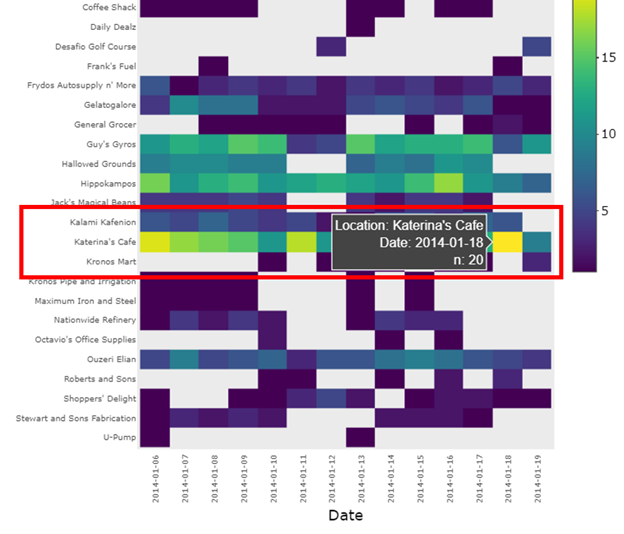{width=100%} Fig 1.1<br><br> 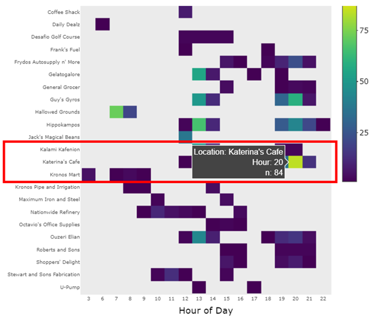{width=100%} Fig 1.2<br><br> 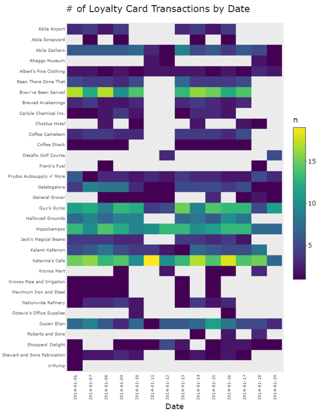{width=100%} Fig 1.3<br><br> 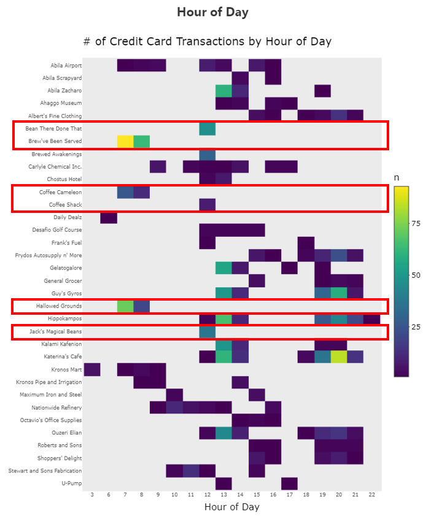{width=100%} Fig 1.4<br><br>|
|2| Vehicle data shows a different dimension of popular locations compared to credit card and loyalty card data. It’s possible to see where people may spend a great deal of time but may not be making purchases using credit cards or loyalty cards (e.g. their homes, their offices, parks, etc.) (see fig 2.1). For example, the most popular location on January 17, 2014 was the GAStech office. This kind of activity information is lacking in the credit card and loyalty card data.<br><br> Generally, vehicle data is aligned with credit card and loyalty card data. Restaurants and coffee shops are also the most popular locations based on vehicle data on January 18, 2014 (a Saturday) (see fig 2.2).<br><br> However, there are some discrepancies. Transaction data may not give the full picture on activity at a location. For example, there were only 2 credit card and loyalty card transactions at the museum on January 18, 2014 which suggests that only 2 people went to the museum on this date. However, there were more than 5 distinct POIs near the museum on January 18, 2014 (see fig 2.2).| 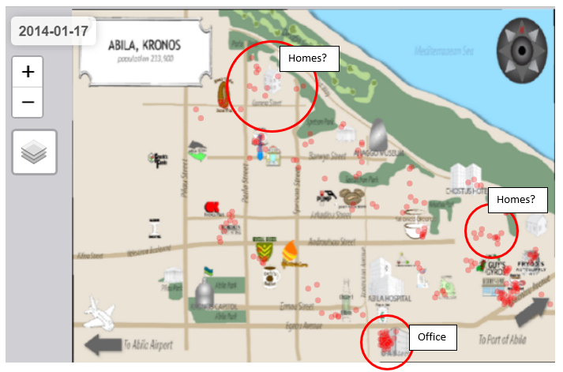{width=100%} Fig 2.1<br><br><br><br> 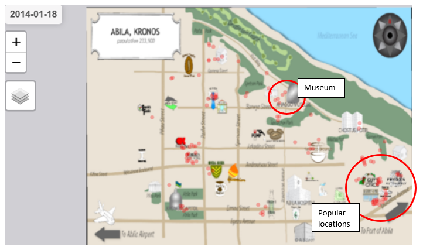{width=100%} Fig 2.2<br><br><br><br>|
|3| To determine the owner of a credit card, first look up a transaction. In this example, I pull transactions made at Desafio Golf Course. Consider the transaction made on credit card 2463 at 1/12/2014, 1:45:00 PM at Desafio Golf Course (see fig 3.1).<br><br> The person who made this transaction should have a POI near the golf course before the time of the transaction. Using the interactive map, there are 3 people who were at the golf course at the same date and time (see fig 3.2):<br> 1) Vasco-Pais Willem (12:49 – 4:22)<br> 2) Campo-Corrente Ada (1:46 – 4:12)<br> 3) Barranco Ingrid (1:06 – 4:05)<br><br> Rule out Campo-Corrente Ada because they arrived after the transaction time. Thus, there’s a 50-50% chance that credit card 2463 is owned by either Vasco-Pais Willem or Barranco Ingrid.<br><br> To improve the odds, look up another transaction made on credit card 2463 to see if Vasco-Pais Willem or Barranco Ingrid can be ruled out. Consider the transaction made on credit card 2463 at 1/8/2014, 12:00 PM at Jack’s Magical Beans (see fig 3.3).<br><br>Again, go back to the interactive map and see if either Vasco-Pais Willem or Barranco Ingrid were at this location around 12PM. Vasco-Pais Willem was at Jack’s Magical Beans on 1/8/2014 but at 6AM, not 12PM (see fig 3.4). Barranco Ingrid was not at Jack’s Magical Beans at all on 1/8/2014. Although  Vasco-Pais Willem was at Jack’s Magical Beans at 6AM and not 12PM as logged by the credit card, it’s possible the transaction time is delayed or not accurate. Thus, the owner of credit card 2463 is likely Vasco-Pais Willem.<br><br> The loyalty card associated with credit card 2463 is L6886 which we know based off joining credit card and loyalty card data (see fig 3.5).| 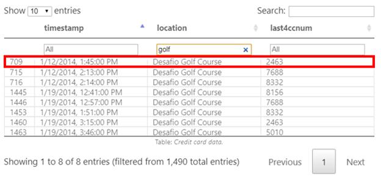{width=100%} Fig 3.1<br><br><br><br> 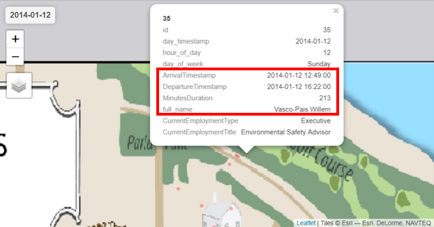{width=100%} Fig 3.2<br><br><br><br> 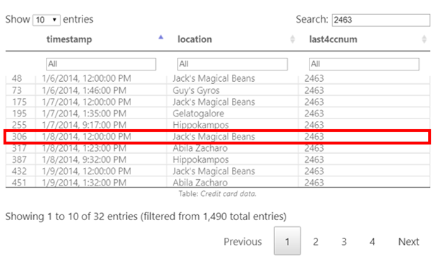{width=100%} Fig 3.3<br><br><br><br> 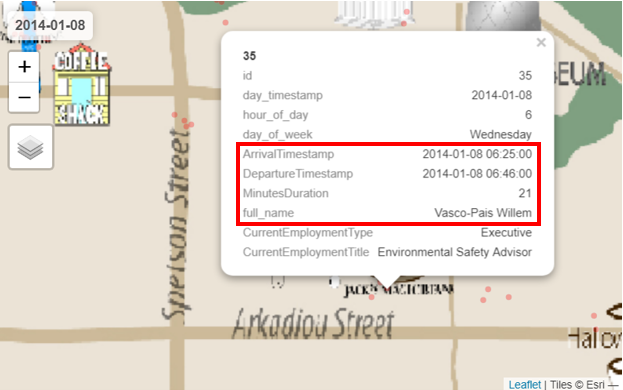{width=100%} Fig 3.4<br><br><br><br> 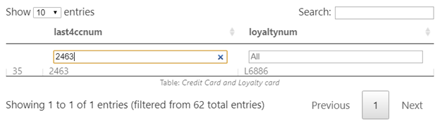{width=100%} Fig 3.5<br><br><br><br>|
|4|To identify relationships, I graph networks using POI data, specifically meets ups. As a reminder, meet ups are POIs that overlap in time and happened in the same area (within 100 meters).<br><br> To narrow down the POIs to informal or unofficial relationships, I graph networks by various time dimensions. First, consider fig 4.1 which graphs meet ups over the weekend (Saturday and Sunday) and were longer than 2 hours. Second, consider fig 4.2 which graphs POIs between 9PM-12AM.<br><br> The potential informal relationships identified from these two network graphs are:<br> 1) Bodrogi Loreto, Ferro Inga, Vann Isia<br> 2) Flecha Sven, Mies Minke, Tempestad Brand<br> 3) Lagos Varja, Nubarron Adra<br> 4) Resumir Felix, Nubarron Adra<br> 5) Resumir Felix, Nubarron Adra, Lagos Varia<br> 6) Bergen Linnea, Ovan Bertrand, Herroro Kanon<br> 7) Mies Minke, Flecha Sven, Tempestad Brand| 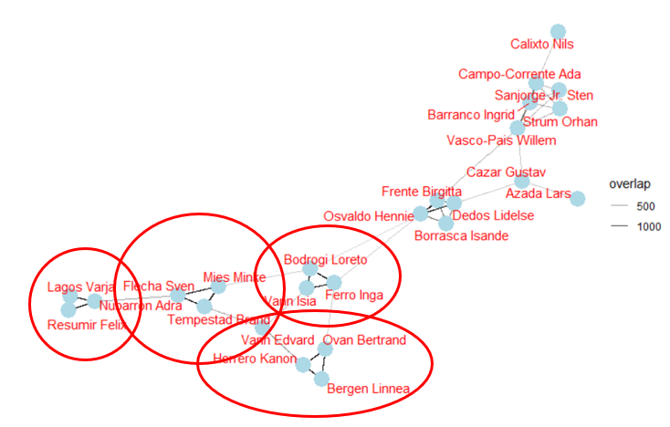{width=100%} Fig 4.1<br><br><br><br> 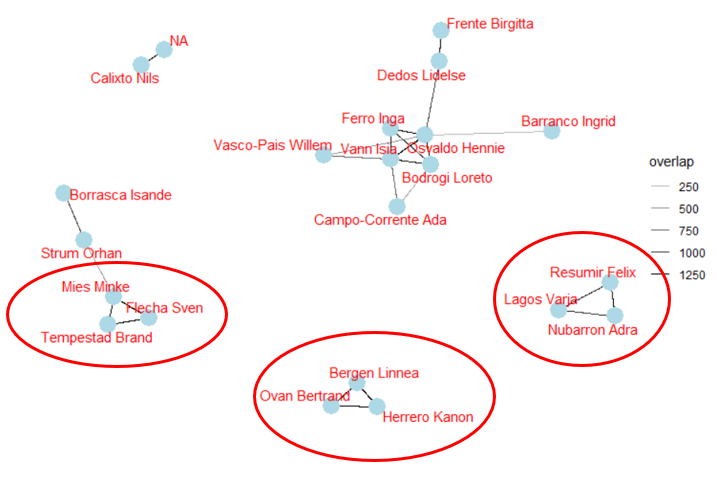{width=100%} Fig 4.2<br><br><br><br>|
|5.1| Bodrogi Loreto and Vann Isia both arrive near Barwyn and Spetson at 3AM on Tuesday, January 7, 2014 and hang around there for roughly 3 hours (see fig 5.1). This appears to be where Campo-Corrente Ada, SVP at GAStech lives based on their GPS data (arrival at 9PM and departure next day at 6AM). What are Loreto and Isia doing at this location at 3AM?| 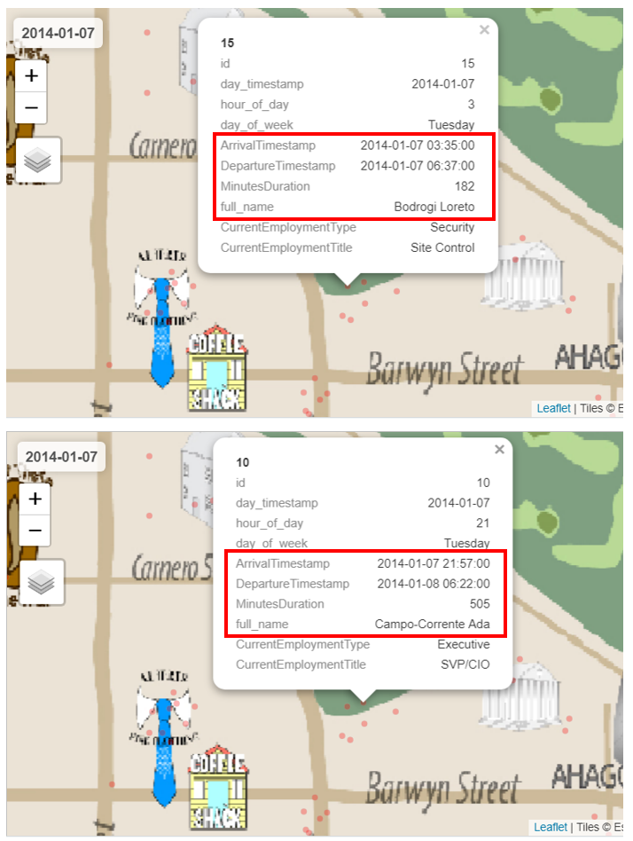{width=100%} Fig 5.1|
|5.2| According to credit card data several transactions were made at Kronos Mart at 3AM which is suspicious onto itself (see fig 5.2). In addition, when cross-referenced with the interactive map, there were no POIs that could have matched with these transactions. Is a data quality issue or surreptitious behavior?| 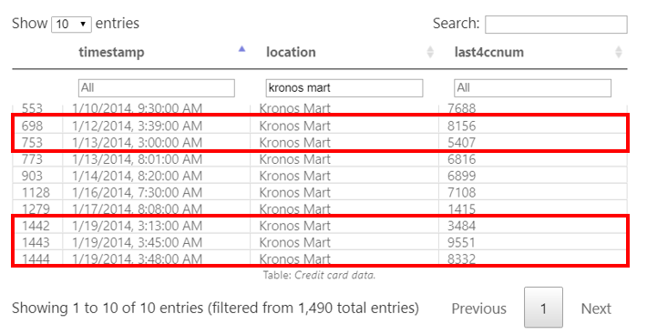{width=100%} Fig 5.2|
|5.3| EDA on boxplots of transaction prices by location revealed some outliers in transactions for several merchants, particularly Frydos Autosupply for $10,000 (see fig 5.3). In addition, the credit card associated with this transaction is credit card 9551 which is one of the credit cards flagged in 5.2 for purchases at Kronos Mart at 3AM.| 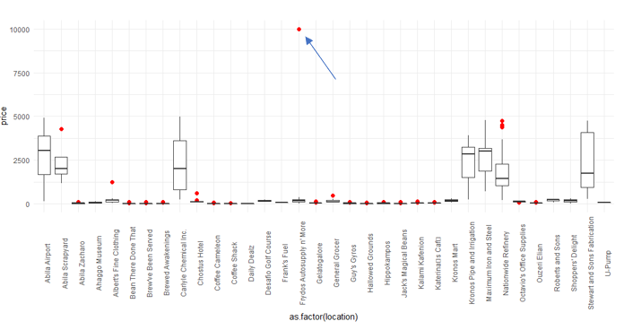{width=100%} Fig 5.3|
|5.4| Calixto Nils from the IT department is regularly at the GAStech office late at night 9PM – 1AM. Why are they are the office so late at night on a regular basis?| 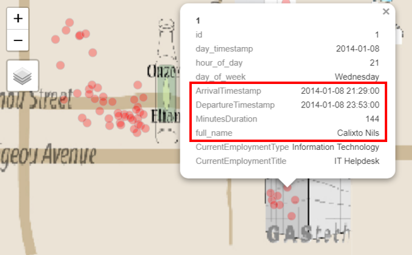{width=100%} Fig 5.4|
|5.5| Off Pilau Street, there’s a location between Frank’s Fuels and Maximum Iron & Steel where Mies Minke and Osvaldo Hennie meet up around 12PM on January 16. In addition, other people appear to come to this location regularly For example, Bodrogi Loreto visits this location on January 7, January 10, 11, and 14. Ferro Inga visits this location on January 9.| 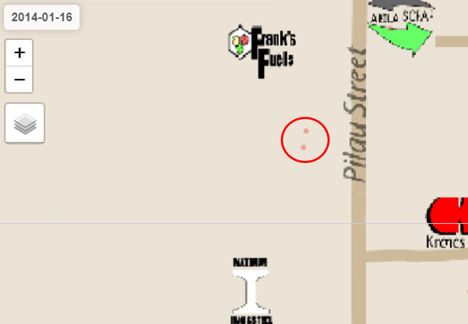{width=100%} Fig 5.5|